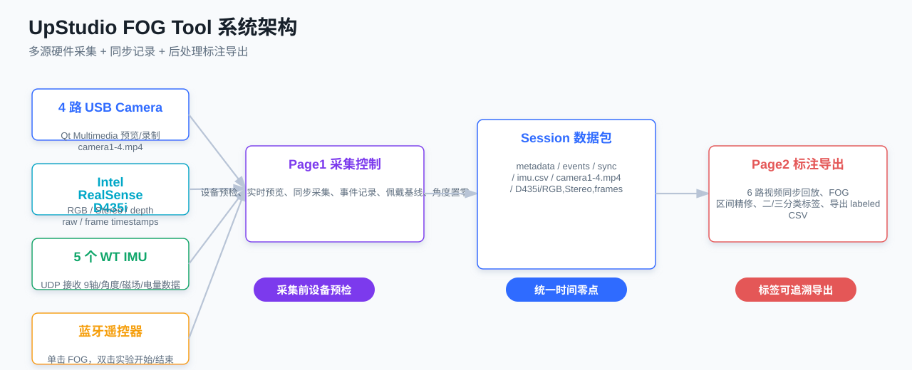
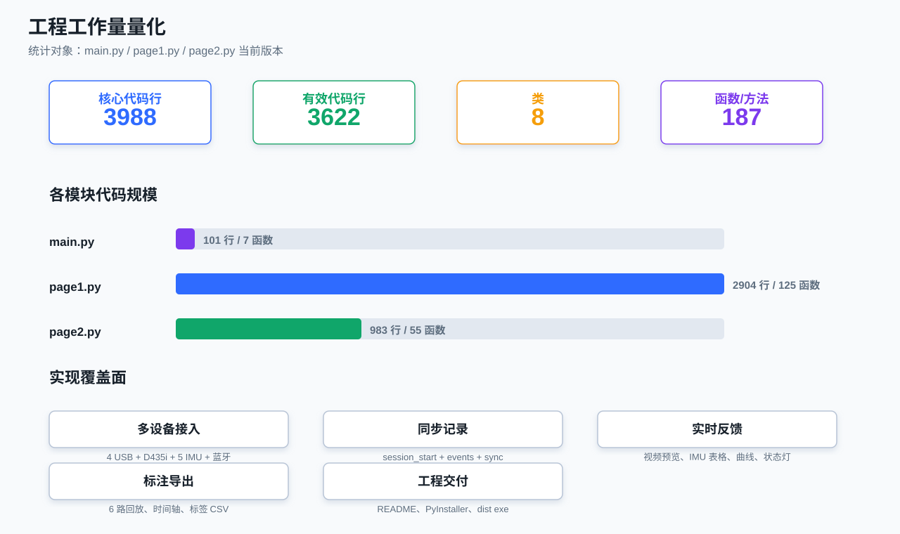
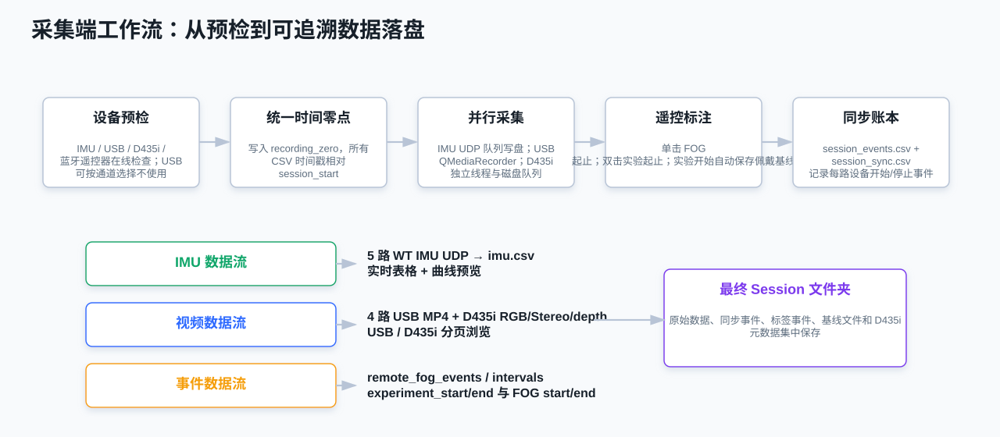
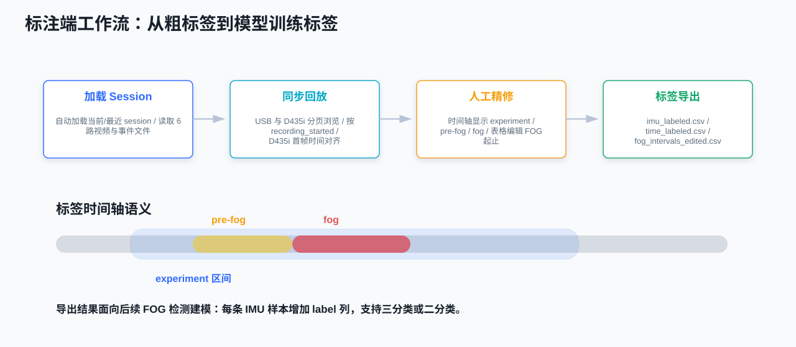
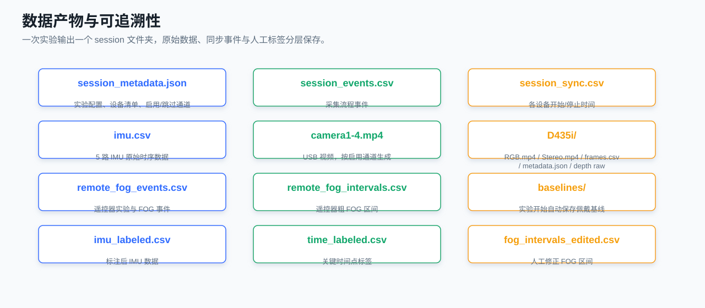
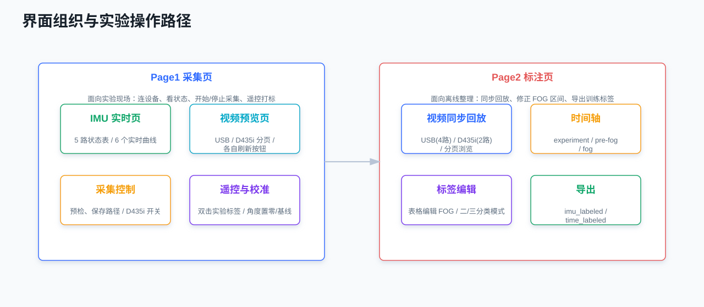

# UpStudio FOG Tool 项目工作量汇报材料

生成时间：2026-07-02 17:20

## 1. 一句话结论

本项目已完成一个面向下肢外骨骼/FOG 实验的多源同步上位机：支持 **4 路 USB 相机、Intel RealSense D435i、5 个 WT IMU、蓝牙遥控器标签** 的现场同步采集，并提供离线 **6 路视频同步回放、FOG 标签精修、IMU 标签导出、exe 打包交付**。

## 2. 工程工作量量化

| 指标 | 数值 |
|---|---:|
| 核心 Python 文件 | 3 个 |
| 核心代码总行数 | 3988 行 |
| 有效代码行 | 3622 行 |
| 类 | 8 个 |
| 函数/方法 | 187 个 |

| 文件 | 总行数 | 有效代码行 | 类 | 函数/方法 | 主要职责 |
|---|---:|---:|---:|---:|---|
| main.py | 101 | 82 | 1 | 7 | 主窗口、页面切换、遥控器按键全局捕获 |
| page1.py | 2904 | 2649 | 5 | 125 | 采集端、IMU UDP、USB/D435i 视频、蓝牙标签、基线、同步账本 |
| page2.py | 983 | 891 | 2 | 55 | 标注端、6 路视频同步回放、时间轴、标签编辑与导出 |

## 3. 已实现的核心功能

### 3.1 采集端 Page1

- 多设备接入：4 路 USB Camera、D435i RGB/Stereo/depth、5 个 WT IMU、蓝牙遥控器。
- 设备预检：开始采集前检查 IMU、相机、D435i、蓝牙遥控器；USB Camera 可单通道选择“不使用”并跳过该路预检。
- 实时反馈：IMU 状态表、实时曲线、USB/D435i 分页视频预览、遥控器连接与按键状态。
- 同步采集：统一 session_start 时间零点，写入 session_events.csv 和 session_sync.csv。
- 遥控标签：单击 FOG 起止，1 秒内双击实验起止；实验开始自动保存佩戴基线。
- IMU 操作：支持在线 IMU 加速度计校准、角度置零、佩戴基线记录。
- 工程交付：PyInstaller spec 与 build_exe.ps1，可生成 Windows 可执行程序。

### 3.2 标注端 Page2

- 自动加载 session：切换到标注页时自动读取当前或最近 session。
- 6 路同步回放：camera1-4 与 D435i RGB/Stereo 同步播放，USB 与 D435i 分页显示。
- 时间对齐：USB 使用 recording_started 事件，D435i 使用 frames.csv 首帧时间，对齐到 session 时间轴。
- 标签精修：时间轴显示 experiment、pre-fog、fog；支持表格编辑 FOG 起止时间。
- 标签模式：支持三分类 normal/pre-fog/fog 和二分类 normal/fog。
- 导出结果：生成 imu_labeled.csv、time_labeled.csv、fog_intervals_edited.csv。

## 4. 数据产物

一次采集会生成完整 session 文件夹，包含原始传感器数据、视频、同步账本、遥控粗标签、基线文件和后处理标签。

## 5. 界面与操作路径

项目按实验现场和离线标注两个场景拆分：Page1 负责采集，Page2 负责标注导出。视频部分已经按 USB 与 D435i 分页，避免 6 路画面挤在同一界面。

## 6. 适合组会强调的结论

1. 从脚本采集升级为完整实验上位机：已覆盖设备接入、预检、采集、同步、标注、导出、打包。
2. 数据链路可追溯：每个 session 都有 metadata、events、sync 三类账本，后续可以复查每路设备的起止时间。
3. FOG 标签闭环已打通：蓝牙遥控器产生粗标签，Page2 基于视频精修，最终落到 IMU 样本级 label。
4. 现场容错能力增强：D435i 可选，USB Camera 可单通道跳过，设备异常会在预检阶段拦截。
5. 已具备交付形态：项目可打包为 dist/UpStudioFOGTool/UpStudioFOGTool.exe，方便迁移到实验电脑。

## 7. 下一阶段建议

- 做多被试/长时长采集压力测试，重点统计 IMU UDP 丢包和 D435i 磁盘写入稳定性。
- 增加采集后质量报告：每路相机文件是否生成、IMU 包计数缺口、标签区间完整性。
- 明确实验 SOP：设备摆放、Wi-Fi 信道、IMU 目标 IP/端口、遥控器单击/双击规则。
- 根据实验需要决定是否在实验开始时自动执行角度置零；目前只自动保存佩戴基线，不自动角度置零。
